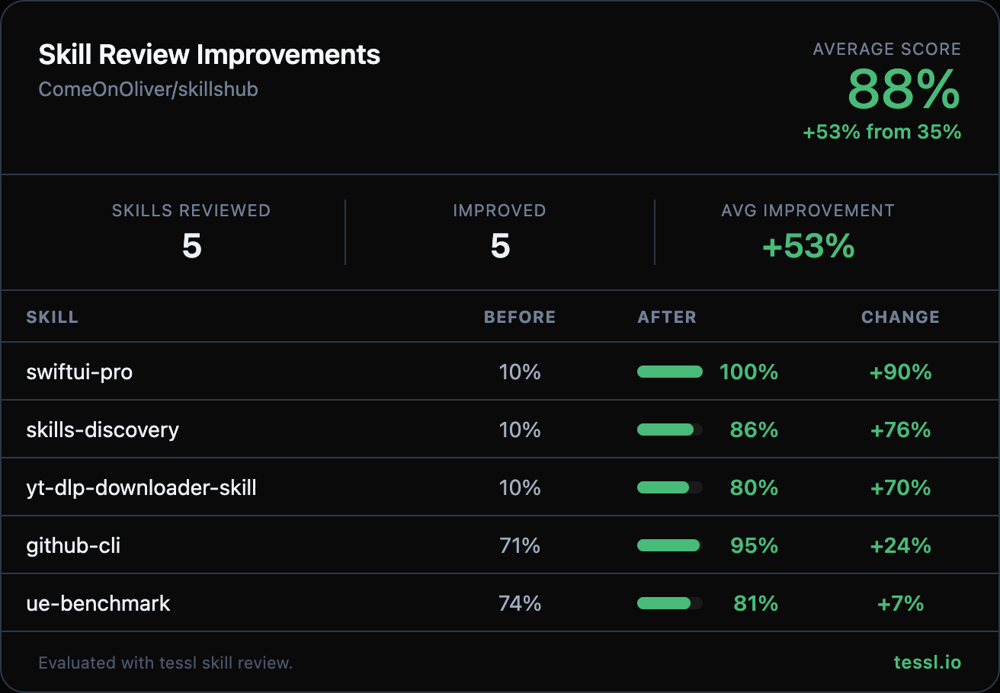

## Description

Hey @ComeOnOliver 👋

I ran your skills through `tessl skill review` at work and found some targeted improvements. Here's the full before/after:

| Skill | Before | After | Change |
|-------|--------|-------|--------|
| swiftui-pro | 10% | 100% | +90% |
| skills-discovery | 10% | 86% | +76% |
| yt-dlp-downloader-skill | 10% | 80% | +70% |
| github-cli | 71% | 95% | +24% |
| ue-benchmark | 74% | 81% | +7% |

The three skills scoring 10% were failing validation entirely because they lacked YAML frontmatter — once that was added, the content quality underneath shone through (especially `swiftui-pro` which hit a perfect 100%).

What changed

**skills-discovery, swiftui-pro, yt-dlp-downloader-skill** (10% → 86%, 100%, 80%):
- Added YAML frontmatter with `name` and `description` fields — these were the only reason for the 10% scores
- Wrote specific, action-oriented descriptions with natural trigger terms and "Use when" clauses
- Converted opening text to third-person voice where needed
- Preserved all existing content and domain expertise intact

**github-cli** (71% → 95%):
- Replaced vague description ("any GitHub-related task") with specific actions (managing repos, PRs, issues, reading READMEs, querying metadata)
- Added natural trigger terms (pull requests, gh CLI, GitHub API endpoints)
- Added concrete use cases to the "When to Use" section

**ue-benchmark** (74% → 81%):
- Rewrote description to include English trigger terms alongside the Chinese content
- Added specific scoring dimensions (PackageGate, PVP protocol, token efficiency) and "Use when" clause

## Type
- [ ] Bug fix
- [ ] New feature
- [x] Refactor
- [ ] Documentation

## Checklist
- [x] `pnpm build` passes
- [x] Changes are tested
- [x] Documentation updated (if needed)
- [x] No new TypeScript errors

## Related Issues
N/A — unsolicited improvement contribution.

---

Honest disclosure — I work at @tesslio where we build tooling around skills like these. Not a pitch - just saw room for improvement and wanted to contribute.

Want to self-improve your skills? Just point your agent (Claude Code, Codex, etc.) at [this Tessl guide](https://docs.tessl.io/evaluate/optimize-a-skill-using-best-practices) and ask it to optimize your skill. Ping me - [@yogesh-tessl](https://github.com/yogesh-tessl) - if you hit any snags.

Thanks in advance 🙏
